# Trendy - Remaining Database Components

## Remaining Models

### Event
```python
class Event(Base):
    __tablename__ = "events"
    
    id = Column(Integer, primary_key=True, index=True)
    name = Column(String, nullable=False)
    description = Column(String, nullable=True)
    creator_id = Column(Integer, ForeignKey("users.id"))
    group_id = Column(Integer, ForeignKey("groups.id"), nullable=True)
    start_time = Column(DateTime, nullable=False)
    end_time = Column(DateTime, nullable=False)
    location = Column(String, nullable=True)  # JSON string for coordinates or address
    is_virtual = Column(Boolean, default=False)
    virtual_link = Column(String, nullable=True)
    max_attendees = Column(Integer, nullable=True)
    created_at = Column(DateTime, default=datetime.utcnow)
    is_public = Column(Boolean, default=True)
    
    # Relationships
    creator = relationship("User", back_populates="events")
    group = relationship("Group", back_populates="events")
    attendances = relationship("EventAttendance", back_populates="event")
```

### EventAttendance
```python
class EventAttendance(Base):
    __tablename__ = "event_attendances"
    
    id = Column(Integer, primary_key=True, index=True)
    event_id = Column(Integer, ForeignKey("events.id"))
    user_id = Column(Integer, ForeignKey("users.id"))
    status = Column(String, default="interested")  # interested, going, not_going
    registered_at = Column(DateTime, default=datetime.utcnow)
    
    # Relationships
    event = relationship("Event", back_populates="attendances")
    user = relationship("User", back_populates="event_attendances")
```

### Challenge
```python
class Challenge(Base):
    __tablename__ = "challenges"
    
    id = Column(Integer, primary_key=True, index=True)
    name = Column(String, nullable=False)
    description = Column(String, nullable=True)
    creator_id = Column(Integer, ForeignKey("users.id"))
    start_date = Column(Date, nullable=False)
    end_date = Column(Date, nullable=False)
    category = Column(String, nullable=True)
    reward_type = Column(String, nullable=True)  # coins, badge, etc.
    reward_amount = Column(Integer, nullable=True)
    is_active = Column(Boolean, default=True)
    created_at = Column(DateTime, default=datetime.utcnow)
    
    # Relationships
    creator = relationship("User")
    participations = relationship("ChallengeParticipation", back_populates="challenge")
```

### ChallengeParticipation
```python
class ChallengeParticipation(Base):
    __tablename__ = "challenge_participations"
    
    id = Column(Integer, primary_key=True, index=True)
    challenge_id = Column(Integer, ForeignKey("challenges.id"))
    user_id = Column(Integer, ForeignKey("users.id"))
    joined_at = Column(DateTime, default=datetime.utcnow)
    completed_at = Column(DateTime, nullable=True)
    is_completed = Column(Boolean, default=False)
    progress = Column(Float, default=0.0)
    
    # Relationships
    challenge = relationship("Challenge", back_populates="participations")
    user = relationship("User", back_populates="challenges")
```

### UserStreak
```python
class UserStreak(Base):
    __tablename__ = "user_streaks"
    
    id = Column(Integer, primary_key=True, index=True)
    user_id = Column(Integer, ForeignKey("users.id"))
    streak_type = Column(String, nullable=False)  # login, post, challenge, etc.
    current_streak = Column(Integer, default=0)
    longest_streak = Column(Integer, default=0)
    last_activity_date = Column(Date, nullable=True)
    updated_at = Column(DateTime, default=datetime.utcnow)
    
    # Relationships
    user = relationship("User", back_populates="streaks")
```

### Poll
```python
class Poll(Base):
    __tablename__ = "polls"
    
    id = Column(Integer, primary_key=True, index=True)
    question = Column(String, nullable=False)
    creator_id = Column(Integer, ForeignKey("users.id"))
    group_id = Column(Integer, ForeignKey("groups.id"), nullable=True)
    is_anonymous = Column(Boolean, default=False)
    allow_multiple_choices = Column(Boolean, default=False)
    expires_at = Column(DateTime, nullable=True)
    created_at = Column(DateTime, default=datetime.utcnow)
    
    # Relationships
    creator = relationship("User")
    group = relationship("Group", back_populates="polls")
    options = relationship("PollOption", back_populates="poll")
    votes = relationship("PollVote", back_populates="poll")
```

### PollOption
```python
class PollOption(Base):
    __tablename__ = "poll_options"
    
    id = Column(Integer, primary_key=True, index=True)
    poll_id = Column(Integer, ForeignKey("polls.id"))
    text = Column(String, nullable=False)
    image_url = Column(String, nullable=True)
    
    # Relationships
    poll = relationship("Poll", back_populates="options")
    votes = relationship("PollVote", back_populates="option")
```

### PollVote
```python
class PollVote(Base):
    __tablename__ = "poll_votes"
    
    id = Column(Integer, primary_key=True, index=True)
    poll_id = Column(Integer, ForeignKey("polls.id"))
    option_id = Column(Integer, ForeignKey("poll_options.id"))
    user_id = Column(Integer, ForeignKey("users.id"))
    voted_at = Column(DateTime, default=datetime.utcnow)
    
    # Relationships
    poll = relationship("Poll", back_populates="votes")
    option = relationship("PollOption", back_populates="votes")
    user = relationship("User")
```

### ScheduledPost
```python
class ScheduledPost(Base):
    __tablename__ = "scheduled_posts"
    
    id = Column(Integer, primary_key=True, index=True)
    post_id = Column(Integer, ForeignKey("posts.id"))
    group_id = Column(Integer, ForeignKey("groups.id"), nullable=True)
    scheduled_at = Column(DateTime, nullable=False)
    created_at = Column(DateTime, default=datetime.utcnow)
    is_published = Column(Boolean, default=False)
    published_at = Column(DateTime, nullable=True)
    
    # Relationships
    post = relationship("Post")
    group = relationship("Group", back_populates="scheduled_posts")
```

### MessageReaction
```python
class MessageReaction(Base):
    __tablename__ = "message_reactions"
    
    id = Column(Integer, primary_key=True, index=True)
    message_id = Column(Integer, ForeignKey("messages.id"))
    user_id = Column(Integer, ForeignKey("users.id"))
    reaction_type = Column(String, nullable=False)  # emoji or custom reaction
    reacted_at = Column(DateTime, default=datetime.utcnow)
    
    # Relationships
    message = relationship("Message", back_populates="reactions")
    user = relationship("User")
```

## Indexing Strategy

To ensure optimal performance, the following indexes should be created:

1. **User Table**
   - Primary key on `id`
   - Unique index on `email`
   - Unique index on `username`
   - Index on `created_at`
   - Index on `is_creator`
   - Index on `last_active`
   - Composite index on `is_verified`, `is_creator`

2. **Post Table**
   - Primary key on `id`
   - Index on `user_id`
   - Index on `created_at`
   - Index on `category`
   - Index on `type`
   - Index on `scheduled_at`
   - Index on `is_draft`
   - Index on `privacy_level`
   - Full-text index on `content` for search

3. **Message Table**
   - Primary key on `id`
   - Index on `sender_id`
   - Index on `receiver_id`
   - Index on `group_id`
   - Index on `sent_at`
   - Index on `is_deleted`
   - Composite index on `sender_id`, `receiver_id`

4. **Group Table**
   - Primary key on `id`
   - Index on `creator_id`
   - Index on `created_at`
   - Index on `is_public`
   - Index on `category`

5. **Notification Table**
   - Primary key on `id`
   - Index on `user_id`
   - Index on `type`
   - Index on `is_read`
   - Index on `created_at`

6. **Transaction Table**
   - Primary key on `id`
   - Index on `user_id`
   - Index on `type`
   - Index on `status`
   - Index on `created_at`

7. **PostAnalytics Table**
   - Primary key on `id`
   - Index on `post_id`
   - Index on `last_updated`

## Database Relationships Diagram

```mermaid
erDiagram
    USER ||--o{ POST : creates
    USER ||--o{ COMMENT : writes
    USER ||--o{ MESSAGE : sends
    USER ||--o{ MESSAGE : receives
    USER ||--o{ NOTIFICATION : receives
    USER ||--o{ USERACHIEVEMENT : earns
    USER ||--o{ SUBSCRIPTION : subscribes_to
    USER ||--o{ SUBSCRIPTION : has_subscribers
    USER ||--o{ TRANSACTION : makes
    USER ||--o{ COINBALANCE : has
    USER ||--o{ PROFILEVIEW : has_views
    USER ||--o{ BLOCKEDUSER : blocks
    USER ||--o{ BLOCKEDUSER : is_blocked_by
    USER ||--o{ GROUPMEMBER : joins
    USER ||--o{ EVENT : creates
    USER ||--o{ EVENTATTENDANCE : attends
    USER ||--o{ CHALLENGEPARTICIPATION : participates_in
    USER ||--o{ USERSTREAK : has
    USER ||--o{ USERPREFERENCE : has
    USER ||--o{ USERDEVICE : uses
    USER ||--o{ USERSESSION : has
    
    POST ||--o{ COMMENT : has
    POST ||--o{ POSTLIKE : liked_by
    POST ||--o{ POSTSHARE : shared_by
    POST ||--o{ POSTBOOKMARK : bookmarked_by
    POST ||--o{ POSTTAG : tagged_with
    POST ||--|| POSTANALYTICS : has_analytics
    POST }|--|| POST : remixed_from
    
    GROUP ||--o{ GROUPMEMBER : has_members
    GROUP ||--o{ MESSAGE : contains
    GROUP ||--o{ EVENT : hosts
    GROUP ||--o{ POLL : contains
    GROUP ||--o{ SCHEDULEDPOST : has_scheduled
    
    MESSAGE ||--o{ MESSAGEREACTION : has_reactions
    MESSAGE }|--|| MESSAGE : replies_to
    
    ACHIEVEMENT ||--o{ USERACHIEVEMENT : earned_by
    
    COINBALANCE ||--o{ COINTRANSACTION : has_transactions
    
    POLL ||--o{ POLLOPTION : has_options
    POLL ||--o{ POLLVOTE : has_votes
    POLLOPTION ||--o{ POLLVOTE : receives_votes
    
    CHALLENGE ||--o{ CHALLENGEPARTICIPATION : has_participants
    
    EVENT ||--o{ EVENTATTENDANCE : has_attendees
```



## Migration Strategy

1. **Phase 1: Core Extensions**
   - Extend User table with new fields
   - Extend Post table with new fields
   - Add essential new tables (Message, Group, Notification)

2. **Phase 2: Monetization Features**
   - Add Subscription, Transaction, CoinBalance, CoinTransaction tables
   - Add related fields to User and Post tables

3. **Phase 3: Engagement Features**
   - Add Achievement, UserAchievement, UserStreak tables
   - Add Poll, PollOption, PollVote tables
   - Add Event, EventAttendance tables

4. **Phase 4: Advanced Features**
   - Add analytics tables (PostAnalytics, ProfileView)
   - Add privacy tables (BlockedUser, UserPreference)
   - Add security tables (UserDevice, UserSession)

5. **Phase 5: Social Features**
   - Add collaboration tables (ScheduledPost, MessageReaction)
   - Add relationship tables (PostShare, PostBookmark, PostTag)

This database design provides a solid foundation for all 174 features requested for Trendy while maintaining scalability and performance.